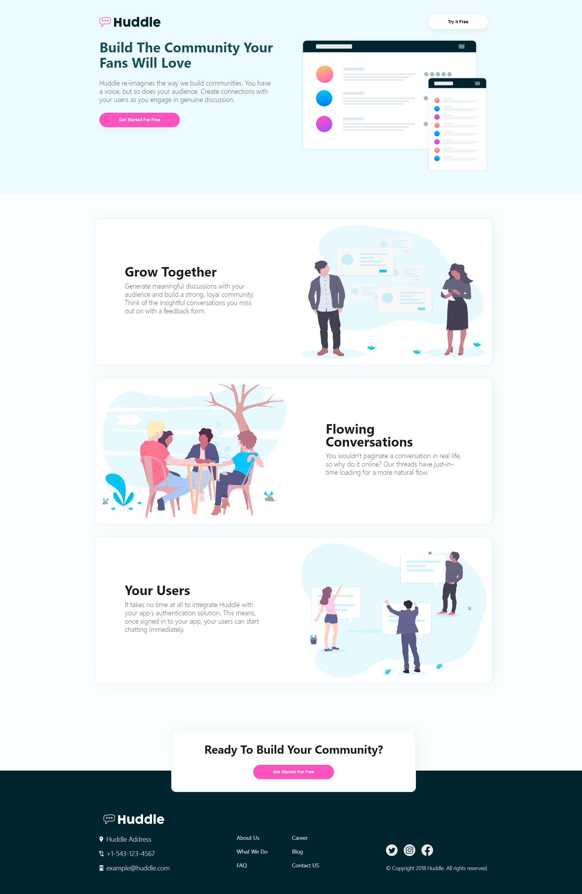

## Getting Started

### 📦 Install

```
$ git clone https://github.com/GabrielDeFreitas/huddle-landing-page-front-end.git

$ yarn install
```

###  How to use

Runs next which starts Next.js in development mode

```bash
$ yarn dev
```

Runs next build which builds the application for production usage

```bash
$ yarn build
```

Runs next start which starts a Next.js production server

```bash
$ yarn start
```

Runs next build and export which exports a files in a `out` folder to deploy

```bash
$ yarn deploy
```

Open [http://localhost:3000](https://www.frontendmentor.io/challenges/huddle-landing-page-with-curved-sections-5ca5ecd01e82137ec91a50f2) with your browser to see the result.

## Commands

- `dev`: runs your application on `localhost:3000`
- `build`: creates the production build version
- `start`: starts a simple server with the build production code
- `lint`: runs the linter in all components and pages
- `test`: runs jest to test all components and pages
- `test:watch`: runs jest in watch mode
- `storybook`: runs storybook on `localhost:6006`
- `build-storybook`: create the build version of storybook
- `generate`: automated file creation

## Screenshot

Layout from [Frontend Mentor](http://localhost:3000)


